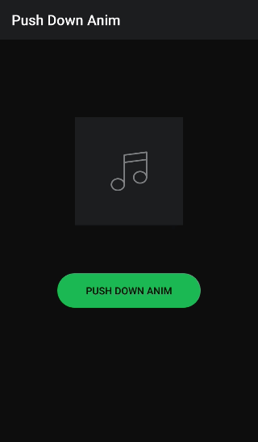

# **「 Push Down Anim Click 」**


#### A library for Android developers who want to create "push down animation click" for view like spotify application. :)





## 「 DEMO APPLICATION 」

```
clone repo and build it :)
```


## 「 Installation 」

Maven
```xml
<dependency>
  <groupId>com.github.thekhaeng</groupId>
  <artifactId>pushdown-anim-click</artifactId>
  <version>1.0.5</version>
  <type>pom</type>
</dependency>
```

Gradle
```gradle
compile( 'com.github.thekhaeng:pushdown-anim-click:1.0.5' ){
    exclude group: 'com.android.support'
}
```

## 「 Usage 」

```java
Button button = findViewById( R.id.button );

PushDownAnim.setOnTouchPushDownAnim( button )
        .setOnClickListener( new View.OnClickListener(){
            @Override
            public void onClick( View view ){
                Toast.makeText( MainActivity.this, "PUSH DOWN !!", Toast.LENGTH_SHORT ).show();
            }

        } );

```

#### full option

```java
PushDownAnim.setOnTouchPushDownAnim( button,
        new View.OnTouchListener(){
            @Override
            public boolean onTouch( View view, MotionEvent motionEvent ){
                return false;
            }
        } )
        .setScale( PushDownAnim.DEFAULT_PUSH_SCALE )
        .setDurationPush( PushDownAnim.DEFAULT_PUSH_DURATION )
        .setDurationRelease( PushDownAnim.DEFAULT_RELEASE_DURATION )
        .setInterpolatorPush( PushDownAnim.DEFAULT_INTERPOLATOR )
        .setInterpolatorRelease( PushDownAnim.DEFAULT_INTERPOLATOR )
        .setOnClickListener( new View.OnClickListener(){
            @Override
            public void onClick( View view ){
                Toast.makeText( MainActivity.this, "PUSH DOWN !!", Toast.LENGTH_SHORT ).show();
            }
        } );

```


# Licence

Copyright 2017 TheKhaeng

Licensed under the Apache License, Version 2.0 (the "License"); you may not use this work except in compliance with the License. You may obtain a copy of the License in the LICENSE file, or at:

http://www.apache.org/licenses/LICENSE-2.0

Unless required by applicable law or agreed to in writing, software distributed under the License is distributed on an "AS IS" BASIS, WITHOUT WARRANTIES OR CONDITIONS OF ANY KIND, either express or implied. See the License for the specific language governing permissions and limitations under the License.


### Developed By Thai android developer.


Follow [facebook.com/thekhaeng.io](https://www.facebook.com/thekhaeng.io) on Facebook page.
or [@nonthawit](https://medium.com/@nonthawit) at my Medium blog. :)

For contact, shoot me an email at nonthawit.thekhaeng@gmail.com

