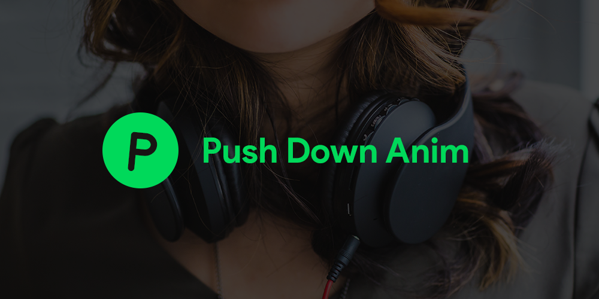
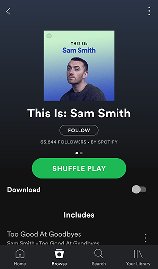
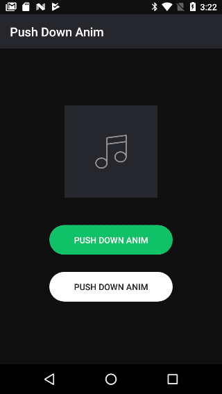
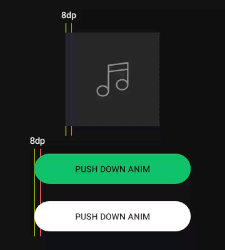
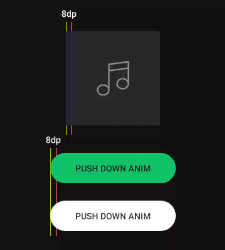

# **「 Push Down Animation Click 」**



[](https://travis-ci.org/TheKhaeng/pushdown-anim-click) [  ](https://bintray.com/nonthawit/TheKhaeng/pushdown-anim-click/_latestVersion) [](https://android-arsenal.com/details/1/6821) [](https://play.google.com/store/apps/details?id=com.thekhaeng.pushdownanimexample)

#### A library for Android developers who want to create "push down animation click" for view like spotify application. :)





## 「 DEMO APPLICATION 」

```
clone repo and build it :)
```

or

<a href="https://play.google.com/store/apps/details?id=com.thekhaeng.pushdownanimexample" target="_blank">

</a>

## 「 UPDATE 」
- **version: 1.1.1**
	- remove `ViewTreeObserver.OnGlobalLayoutListener` use getMeasuredWidth()/getMeasuredHeight() instead

- **version: 1.1.0**
	- add `setOnLongClickListener(...)`
	- add new mode
	    - `MODE_SCALE`
	    - `MODE_STATIC_DP`

- **version: 1.0.8**
	- change `setOnTouchPushDownAnim(...)` to `setPushDownAnimTo(...) `
	- can set multiple view at `setPushDownAnimTo(...)`

## 「 Installation 」

Maven
```xml
<dependency>
  <groupId>com.github.thekhaeng</groupId>
  <artifactId>pushdown-anim-click</artifactId>
  <version>1.1.1</version>
  <type>pom</type>
</dependency>
```

Gradle
```gradle
compile( 'com.github.thekhaeng:pushdown-anim-click:1.1.1' ){
    exclude group: 'com.android.support'
}
```

## 「 Usage 」

```java
Button button = findViewById( R.id.button );

PushDownAnim.setPushDownAnimTo( button, ... )
        .setOnClickListener( new View.OnClickListener(){
            @Override
            public void onClick( View view ){
                Toast.makeText( MainActivity.this, "PUSH DOWN !!", Toast.LENGTH_SHORT ).show();
            }

        } );

```

#### Full option

```java
PushDownAnim.setPushDownAnimTo( button, ... )
        .setScale( MODE_SCALE | MODE_STATIC_DP,
         	   PushDownAnim.DEFAULT_PUSH_SCALE | PushDownAnim.DEFAULT_PUSH_STATIC  ) 
        .setDurationPush( PushDownAnim.DEFAULT_PUSH_DURATION )
        .setDurationRelease( PushDownAnim.DEFAULT_RELEASE_DURATION )
        .setInterpolatorPush( PushDownAnim.DEFAULT_INTERPOLATOR )
        .setInterpolatorRelease( PushDownAnim.DEFAULT_INTERPOLATOR )
        .setOnClickListener( new View.OnClickListener(){
            @Override
            public void onClick( View view ){
                Toast.makeText( MainActivity.this, "PUSH DOWN !!", Toast.LENGTH_SHORT ).show();
            }
        } )
        .setOnLongClickListener( new View.OnLongClickListener(){
            @Override
            public boolean onLongClick( View view ){
		Toast.makeText( MainActivity.this, "LONG PUSH DOWN !!", Toast.LENGTH_SHORT ).show();
                return true; // true: not effect to single click
            }
        } )
        .setOnTouchEvent( new View.OnTouchListener(){
            @Override
            public boolean onTouch( View view, MotionEvent motionEvent ){
                return false;
            }
        } );

```

#### Default values

- Default mode: `MODE_SCALE`
- Default scale: `0.97f`
- Default push duration: `50 millisecond`
- Default release duration:  `125 millisecond`
- Default interpolator push/release: `AccelerateDecelerateInterpolator()`


## 「 MODE 」

**1. `MODE_SCALE`**: use range scale **0.00 - 1.00** to push down view.

>**EXAMPLE:** This case 8dp ≈ 0.89 scale



```java
PushDownAnim.setPushDownAnimTo( button )
	.setScale( MODE_SCALE, 0.89f  ) 
        ...;
```

**2. `MODE_STATIC_DP`**: use static dp unit to push down view.

>**EXAMPLE:** 8dp static scale




```java
PushDownAnim.setPushDownAnimTo( button )
	.setScale( MODE_STATIC_DP, 8  ) 
        ...;
```


## 「 Long Click 」

`setOnClickListener(...)`

```java
@Override
public boolean onLongClick( View view ){
    ...
    return true; // true: not effect to single click
}
```

>NOTE: If you do not want to trigger a normal click **`return true`**

## 「 Disable Click Programmatically 」

If your project has logic that want to disable click programmatically. You must use **``setEnabled(...)``** (do not use **`setClickable(...)`** it is not effective.)

```java
button.setEnabled( false );
```


# Licence

Copyright 2017 TheKhaeng

Licensed under the Apache License, Version 2.0 (the "License"); you may not use this work except in compliance with the License. You may obtain a copy of the License in the LICENSE file, or at:

http://www.apache.org/licenses/LICENSE-2.0

Unless required by applicable law or agreed to in writing, software distributed under the License is distributed on an "AS IS" BASIS, WITHOUT WARRANTIES OR CONDITIONS OF ANY KIND, either express or implied. See the License for the specific language governing permissions and limitations under the License.


### Developed By Thai android developer.


[](https://www.facebook.com/nonthawit) [](https://www.facebook.com/thekhaeng.io/)


Follow [facebook.com/thekhaeng.io](https://www.facebook.com/thekhaeng.io) on Facebook page.
or [@nonthawit](https://medium.com/@nonthawit) at my Medium blog. :)

For contact, shoot me an email at nonthawit.thekhaeng@gmail.com

